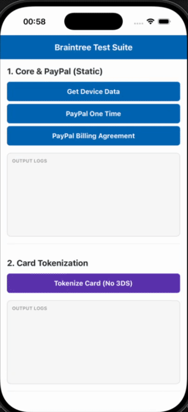
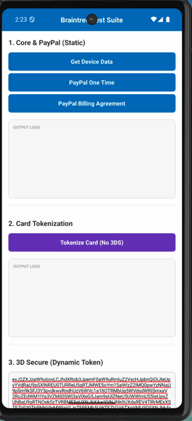

# react-native-expo-braintree

A high-performance, native implementation of the [Braintree SDK](https://developer.paypal.com/braintree/docs/start/overview) for React Native and Expo, powered by [Nitro Modules](https://nitro.margelo.com/).

> [!NOTE]
> This package is the successor to `react-native-paypal-reborn`. The name change reflects the addition of first-class Expo support. All future updates and features will be released under `react-native-expo-braintree`.

[](https://www.npmjs.com/package/react-native-expo-braintree)
[](LICENSE)
[](README.md)

---

> [!WARNING]
> **Version Deprecation Notice**
> Starting with the release of version **4.x**, all support for version **3.x** has been discontinued. There will be no further features, bug fixes, or compatibility patches released for the 3.x line.
> It is **highly recommended** to upgrade to version **4.x** (which features a full native rewrite powered by high-performance JSI Nitro Modules).

> [!NOTE]
> **Legacy Documentation (v3.x)**
> If you are still using the legacy version 3.x of this library, you can refer to the following guides:
> - **Expo Integration**: [INTEGRATION_3.X_EXPO.md](INTEGRATION_3.X_EXPO.md)
> - **Bare React Native (CLI) Integration**: [INTEGRATION_3.X_REACT_NATIVE_CLI.md](INTEGRATION_3.X_REACT_NATIVE_CLI.md)
> - **Usage Reference**: [USAGE_3.X.md](USAGE_3.X.md)

---

## Key Features

- **Nitro Modules Architecture**: Uses direct JSI bindings bypassing the legacy React Native bridge for zero-serialization overhead and near-instantaneous call execution.
- **Full Payment Method Coverage**: Support for 7 Braintree payment types.
- **Expo Config Plugin**: Out-of-the-box support for Expo SDK 53, 54, and 55 with minimal configuration.

### Supported Payment Methods

| Method | Android | iOS | Details |
| :--- | :---: | :---: | :--- |
| **PayPal One-Time Payment** | ✅ | ✅ | Standard checkout flow |
| **PayPal Billing Agreement** | ✅ | ✅ | Vaulting checkout flow |
| **Card Tokenization** | ✅ | ✅ | Direct credit card input tokenization |
| **3D Secure** | ✅ | ✅ | Bank risk check verification |
| **Venmo** | ✅ | ✅ | Venmo App / Web authentication switch |
| **Google Pay** | ✅ | N/A | Google Pay sheets integration |
| **Data Collector** | ✅ | ✅ | Advanced fraud tracking / device data profiling |

---

## Compatibility Matrix

### Native SDK Versions

| Package Version   | Braintree Android | Braintree iOS | Min Android SDK | Min iOS |
| :---------------- | :---------------: | :-----------: | :-------------: | :-----: |
| **4.0.0**         |      v5.19.0      |    v7.5.0     |       23        |  15.1   |
| **3.5.0**         |      v5.19.0      |    v7.5.0     |       23        |  15.1   |
| **3.4.0**         |      v5.19.0      |    v6.41.0    |       23        |  15.1   |
| **3.3.0**         |      v5.19.0      |    v6.41.0    |       23        |  15.1   |
| **3.2.0 - 3.2.2** |      v5.19.0      |    v6.41.0    |       23        |  15.1   |
| **3.1.0**         |      v5.9.x       |    v6.31.0    |       23        |  14.0   |
| **3.0.1 - 3.0.5** |      v5.2.x       |    v6.23.3    |       23        |  14.0   |
| **2.2.0 - 2.4.0** |      v4.41.x      |    v6.17.0    |       21        |  14.0   |

### Expo SDK Support

| Package Version   | Supported Expo SDK |
| :---------------- | :----------------- |
| **4.0.0**         | 53, 54, 55         |
| **3.2.1+**        | 53, 54             |
| **3.0.3 - 3.1.0** | 50, 51, 52         |
| **3.0.1 - 3.0.2** | 50, 51             |
| **2.5.0**         | 50, 51, 52         |
| **2.2.0 - 2.4.0** | 50, 51             |

### Feature History

| Package Version | Release Key Features & Changes |
| :-------------- | :----------------------------- |
| **4.0.0**       | Core native rewrite in Kotlin & Swift powered by Margelo's JSI Nitro Modules (high performance, sync/async invocation, zero bridge-overhead) |
| **3.5.0**       | Braintree iOS SDK v7 update |
| **3.4.0**       | Google Pay Feature Added |
| **3.3.0**       | 3D Secure Feature Added |

---

## Installation

```sh
npm install react-native-expo-braintree react-native-nitro-modules
```

> [!NOTE]
> `react-native-nitro-modules` must be installed as a peer dependency alongside this package as it provides the core JSI binding framework.

---

## Integration

Please refer to the following guides to configure Braintree inside your project structure:

- **Expo Configuration (Expo SDK 53+)**: Follow the [INTEGRATION_4.X_EXPO.md](INTEGRATION_4.X_EXPO.md) guide.
- **Bare React Native Configuration (CLI)**: Follow the [INTEGRATION_4.X_REACT_NATIVE_CLI.md](INTEGRATION_4.X_REACT_NATIVE_CLI.md) guide.

---

## Usage

For complete API listings, TypeScript structures, enums, and quick examples, check the [USAGE_4.X.md](USAGE_4.X.md) guide.

---

## Demos




---

## Troubleshooting Guide

### 1. Required Setup: Android App Links
Braintree Android SDK v5 requires the configuration of App Links rather than legacy custom deep links.
- **Official Setup Instruction**: Refer to the Braintree [App Links setup guide](https://github.com/braintree/braintree_android/blob/main/APP_LINK_SETUP.md).
- **Server Configuration**: Your web domain must host a valid association configuration file at `https://your-domain.com/.well-known/assetlinks.json`. An example configuration is available at the [Braintree Example assetlinks.json](https://braintree-example-app.web.app/.well-known/assetlinks.json).
- **Validation**: Verify that the package association has been verified on the target device:
  ```sh
  adb -d shell pm get-app-links <YOUR_PACKAGE_NAME>
  ```
  Expected output for verified host: `your-braintree-domain.com: verified`.

### 2. Common Integration Issues

#### A. Missing Fallback Scheme (Android)
- **Symptom**: `TOKENIZE_VAULT_PAYMENT_ERROR` is returned during `requestBillingAgreement` calls on Android devices.
- **Fix**: Configure `addFallbackUrlScheme` in the Expo plugin properties:
  ```json
  "plugins": [
    ["react-native-expo-braintree", {
      "host": "your-domain.com",
      "pathPrefix": "/payments",
      "addFallbackUrlScheme": "true"
    }]
  ]
  ```
  *Note: Ensure the fallback scheme ends with `.braintree` (e.g. `com.your.app.braintree`).*

#### B. 3DSecure Layout Crash (Android 14+)
- **Symptom**: Window layout issues or crashes during the 3D Secure modal trigger on Android 14.
- **Fix**: Add the following dependency to [build.gradle](android/build.gradle):
  ```gradle
  dependencies {
      api "androidx.activity:activity:1.9.3"
  }
  ```

---

## Support

If you continue to experience issues after verifying the App Link state and the Fallback Scheme, please create an Issue on the GitHub repository:
[GitHub Issues](https://github.com/msasinowski/react-native-expo-braintree/issues)

---

## Special Thanks

- **iacop0** — For introducing Venmo Integration and Android Version Bump.

---

## Roadmap

- [x] Complete native module rewrite in Kotlin & Swift powered by JSI Nitro Modules (v4.0.0)
- [x] Venmo Integration
- [x] 3D-Secure
- [x] Google Pay
- [ ] Apple Pay (TBD)

---

## License

This project is licensed under the MIT License - see the [LICENSE](LICENSE) file for details.
